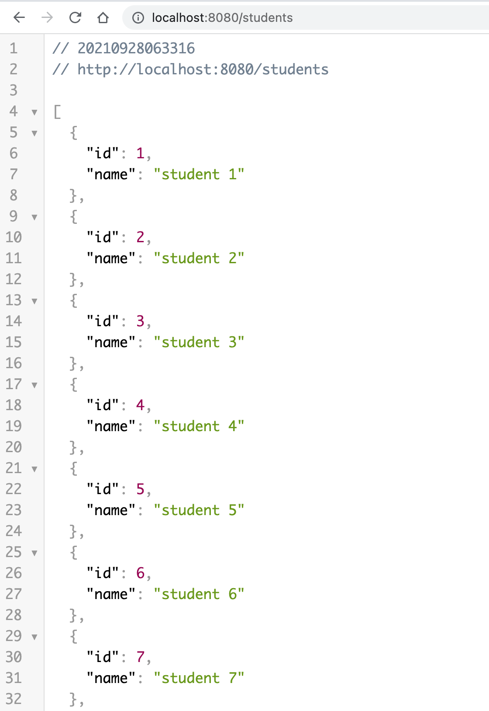
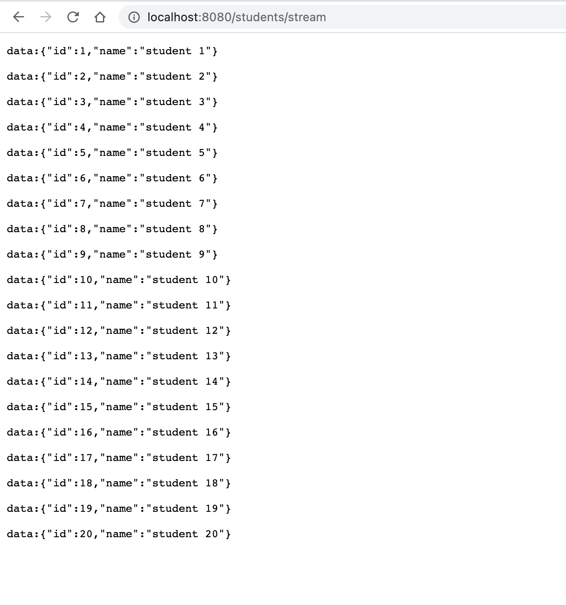

# spring-reactive-webflux-demo

### Things to do list:

1. Clone this repository: `git clone https://github.com/hendisantika/spring-reactive-webflux-demo.git`
2. Navigate to the folder: `cd spring-reactive-webflux-demo`
3. Run the application: `mvn clean spring-boot:run`
4. Open your favorite browser: http://localhost:8080/students
5. pen your favorite browser: http://localhost:8080/students/stream

### Images Screen shot

Router Function

Stream Function

